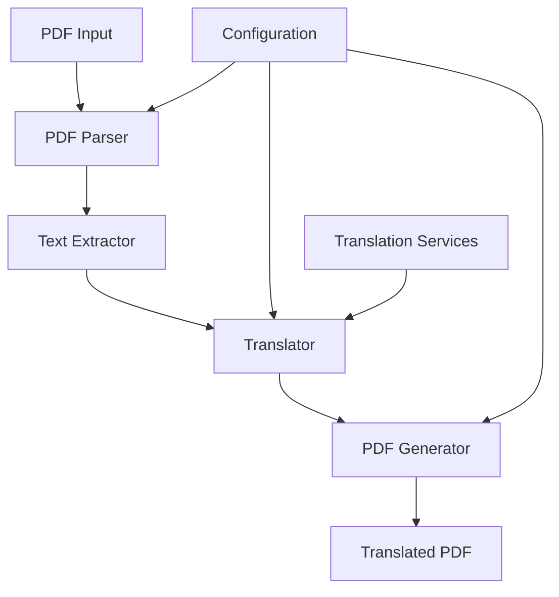
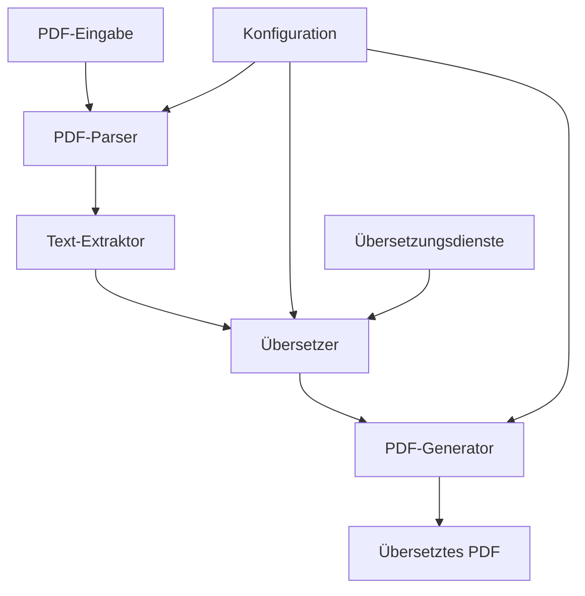

>
> **Need help?** Join our [Discord Community](https://discord.gg/your-invite-link)!

## Installation

### Prerequisites

- Python 3.8+
- `pip` (Python package manager)

### Install via pip

```bash
pip install pdf2zh
```

### Install from Source

1. Clone the repository:
   ```bash
   git clone https://github.com/PDFMathTranslate/PDFMathTranslate-next.git
   cd PDFMathTranslate-next
   ```

2. Install dependencies:
   ```bash
   pip install -e .
   ```

### Verify Installation

```bash
pdf2zh --version
```

## Quick Start

### Basic Usage

1. **Translate a PDF file**:
   ```bash
   pdf2zh translate input.pdf
   ```
   This will create `input_translated.pdf` in the same directory.

2. **Specify output file**:
   ```bash
   pdf2zh translate input.pdf -o output.pdf
   ```

3. **Translate to different language**:
   ```bash
   pdf2zh translate input.pdf -l en  # English translation
   ```

### Web Interface

Launch the web UI:

```bash
pdf2zh web
```

Then open `http://localhost:8501` in your browser.

## Advanced Usage

### Configuration File

Create `config.yaml`:

```yaml
translation_service: "google"
target_language: "zh"
api_key: "your_api_key"
```

Use config file:

```bash
pdf2zh translate input.pdf -c config.yaml
```

### Batch Processing

Process multiple files:

```bash
pdf2zh batch-translate *.pdf
```

### API Usage

```python
from pdf2zh import PDFTranslator

translator = PDFTranslator()
result = translator.translate("input.pdf")
print(result.text)
```

## Supported Languages

The tool supports translation between these languages:

| Language | Code |
|----------|------|
| Chinese | `zh` |
| English | `en` |
| Japanese | `ja` |
| Korean | `ko` |
| French | `fr` |
| German | `de` |
| Spanish | `es` |

See [Supported Languages](supported_languages.md) for complete list.

## Troubleshooting

### Common Issues

1. **Missing Dependencies**:
   ```bash
   pip install -r requirements.txt
   ```

2. **API Key Errors**:
   - Ensure correct API key configuration
   - Check service quotas

3. **PDF Extraction Issues**:
   - Try with different PDF engines
   - Check PDF file permissions

### Getting Help

- Check [FAQ](faq.md)
- Join [Discord Community](https://discord.gg/your-invite-link)
- Create [GitHub Issue](https://github.com/PDFMathTranslate/PDFMathTranslate-next/issues)

## Contributing

We welcome contributions! Please see:

- [Contributing Guide](contributing.md)
- [Code of Conduct](code_of_conduct.md)

## License

MIT License - see [LICENSE](LICENSE) file for details.

---

> [!TIP]
> For the best experience:
>
> - Use high-quality PDFs with clear text
> - Ensure sufficient API quotas for translation services
> - Process large documents in batches

---

### TRANSLATION RESULT

> [!NOTE]
> Diese Dokumentation kann KI-generierte Inhalte enthalten. Obwohl wir auf Genauigkeit achten, können Ungenauigkeiten auftreten. Bitte melden Sie etwaige Probleme über:
>
> - [GitHub Issues](https://github.com/PDFMathTranslate/PDFMathTranslate-next/issues)
> - Gemeinschaftsbeiträge (PRs willkommen!)
>
> **Brauchen Sie Hilfe?** Treten Sie unserer [Discord Community](https://discord.gg/your-invite-link) bei!

## Installation

### Voraussetzungen

- Python 3.8+
- `pip` (Python-Paketmanager)

### Installation über pip

```bash
pip install pdf2zh
```

### Installation von der Quelle

1. Repository klonen:
   ```bash
   git clone https://github.com/PDFMathTranslate/PDFMathTranslate-next.git
   cd PDFMathTranslate-next
   ```

2. Abhängigkeiten installieren:
   ```bash
   pip install -e .
   ```

### Installation überprüfen

```bash
pdf2zh --version
```

## Erste Schritte

### Grundlegende Verwendung

1. **Eine PDF-Datei übersetzen**:
   ```bash
   pdf2zh translate input.pdf
   ```
   Dies erstellt `input_translated.pdf` im gleichen Verzeichnis.

2. **Ausgabedatei angeben**:
   ```bash
   pdf2zh translate input.pdf -o output.pdf
   ```

3. **In eine andere Sprache übersetzen**:
   ```bash
   pdf2zh translate input.pdf -l en  # Englische Übersetzung
   ```

### Weboberfläche

Starten Sie die Web-Oberfläche:

```bash
pdf2zh web
```

Öffnen Sie dann `http://localhost:8501` in Ihrem Browser.

## Erweiterte Verwendung

### Konfigurationsdatei

Erstellen Sie `config.yaml`:

```yaml
translation_service: "google"
target_language: "zh"
api_key: "your_api_key"
```

Verwenden Sie die Konfigurationsdatei:

```bash
pdf2zh translate input.pdf -c config.yaml
```

### Stapelverarbeitung

Mehrere Dateien verarbeiten:

```bash
pdf2zh batch-translate *.pdf
```

### API-Verwendung

```python
from pdf2zh import PDFTranslator

translator = PDFTranslator()
result = translator.translate("input.pdf")
print(result.text)
```

## Unterstützte Sprachen

Das Tool unterstützt die Übersetzung zwischen diesen Sprachen:

| Sprache | Code |
|---------|------|
| Chinesisch | `zh` |
| Englisch | `en` |
| Japanisch | `ja` |
| Koreanisch | `ko` |
| Französisch | `fr` |
| Deutsch | `de` |
| Spanisch | `es` |

Siehe [Unterstützte Sprachen](supported_languages.md) für die vollständige Liste.

## Fehlerbehebung

### Häufige Probleme

1. **Fehlende Abhängigkeiten**:
   ```bash
   pip install -r requirements.txt
   ```

2. **API-Schlüssel-Fehler**:
   - Stellen Sie die korrekte API-Schlüssel-Konfiguration sicher
   - Überprüfen Sie die Service-Kontingente

3. **PDF-Extraktionsprobleme**:
   - Versuchen Sie es mit verschiedenen PDF-Engines
   - Überprüfen Sie die PDF-Dateiberechtigungen

### Hilfe erhalten

- Lesen Sie [FAQ](faq.md)
- Treten Sie der [Discord Community](https://discord.gg/your-invite-link) bei
- Erstellen Sie ein [GitHub Issue](https://github.com/PDFMathTranslate/PDFMathTranslate-next/issues)

## Mitwirken

Wir freuen uns über Beiträge! Bitte lesen Sie:

- [Contributing Guide](contributing.md)
- [Code of Conduct](code_of_conduct.md)

## Lizenz

MIT-Lizenz - siehe [LICENSE](LICENSE)-Datei für Details.

---

> [!TIP]
> Für die beste Erfahrung:
>
> - Verwenden Sie hochwertige PDFs mit klarem Text
> - Stellen Sie ausreichende API-Kontingente für Übersetzungsdienste sicher
> - Verarbeiten Sie große Dokumente in Stapeln

---

`do_translate_async_stream` is a function in the `pdf2zh` package that provides asynchronous streaming translation capabilities. It allows you to translate a list of text segments in real-time, with the ability to process each translated segment as soon as it is available.

### Function Signature

```python
async def do_translate_async_stream(
    text_list: List[str],
    target_language: str = 'zh',
    source_language: str = 'auto',
    translation_service: str = 'google',
    translation_service_config: Optional[Dict] = None,
    on_translated: Optional[Callable[[str], None]] = None,
    on_finished: Optional[Callable[[], None]] = None,
    on_error: Optional[Callable[[Exception], None]] = None
) -> None
```

### Parameters

- `text_list` (List[str]): A list of text segments to be translated.
- `target_language` (str, optional): The target language code for translation. Defaults to 'zh' (Chinese).
- `source_language` (str, optional): The source language code. Use 'auto' for automatic detection. Defaults to 'auto'.
- `translation_service` (str, optional): The translation service to use. Defaults to 'google'.
- `translation_service_config` (Dict, optional): Configuration parameters for the translation service. Defaults to None.
- `on_translated` (Callable[[str], None], optional): A callback function that is called each time a segment is translated. The translated text is passed as an argument.
- `on_finished` (Callable[[], None], optional): A callback function that is called when all segments have been translated.
- `on_error` (Callable[[Exception], None], optional): A callback function that is called if an error occurs during translation.

### Usage Example

```python
import asyncio
from pdf2zh import do_translate_async_stream

async def main():
    text_list = [
        "Hello, world!",
        "This is a test.",
        "How are you?"
    ]
    
    def on_translated(text):
        print(f"Translated: {text}")
    
    def on_finished():
        print("All translations completed!")
    
    def on_error(error):
        print(f"Error: {error}")
    
    await do_translate_async_stream(
        text_list=text_list,
        target_language='de',
        on_translated=on_translated,
        on_finished=on_finished,
        on_error=on_error
    )

asyncio.run(main())
```

### Notes

- This function is asynchronous and must be called with `await`.
- The streaming nature allows for real-time processing of translations, which can be useful for applications that require immediate feedback.
- For more details on available translation services and their configurations, refer to the [Documentation of Translation Services](translation_services.md).

---

## Python API: do_translate_async_stream
---

`do_translate_async_stream` ist eine Funktion im `pdf2zh`-Paket, die asynchrone Streaming-Übersetzungsfunktionen bereitstellt. Sie ermöglicht die Echtzeitübersetzung einer Liste von Textsegmenten, wobei jedes übersetzte Segment sofort verarbeitet werden kann, sobald es verfügbar ist.

### Funktionssignatur

```python
async def do_translate_async_stream(
    text_list: List[str],
    target_language: str = 'zh',
    source_language: str = 'auto',
    translation_service: str = 'google',
    translation_service_config: Optional[Dict] = None,
    on_translated: Optional[Callable[[str], None]] = None,
    on_finished: Optional[Callable[[], None]] = None,
    on_error: Optional[Callable[[Exception], None]] = None
) -> None
```

### Parameter

- `text_list` (List[str]): Eine Liste von Textsegmenten, die übersetzt werden sollen.
- `target_language` (str, optional): Der Sprachcode der Zielsprache für die Übersetzung. Standardmäßig 'zh' (Chinesisch).
- `source_language` (str, optional): Der Sprachcode der Ausgangssprache. Verwenden Sie 'auto' für automatische Erkennung. Standardmäßig 'auto'.
- `translation_service` (str, optional): Der zu verwendende Übersetzungsdienst. Standardmäßig 'google'.
- `translation_service_config` (Dict, optional): Konfigurationsparameter für den Übersetzungsdienst. Standardmäßig None.
- `on_translated` (Callable[[str], None], optional): Eine Callback-Funktion, die jedes Mal aufgerufen wird, wenn ein Segment übersetzt wurde. Der übersetzte Text wird als Argument übergeben.
- `on_finished` (Callable[[], None], optional): Eine Callback-Funktion, die aufgerufen wird, wenn alle Segmente übersetzt wurden.
- `on_error` (Callable[[Exception], None], optional): Eine Callback-Funktion, die aufgerufen wird, wenn während der Übersetzung ein Fehler auftritt.

### Verwendungsbeispiel

```python
import asyncio
from pdf2zh import do_translate_async_stream

async def main():
    text_list = [
        "Hello, world!",
        "This is a test.",
        "How are you?"
    ]
    
    def on_translated(text):
        print(f"Translated: {text}")
    
    def on_finished():
        print("All translations completed!")
    
    def on_error(error):
        print(f"Error: {error}")
    
    await do_translate_async_stream(
        text_list=text_list,
        target_language='de',
        on_translated=on_translated,
        on_finished=on_finished,
        on_error=on_error
    )

asyncio.run(main())
```

### Hinweise

- Diese Funktion ist asynchron und muss mit `await` aufgerufen werden.
- Die Streaming-Fähigkeit ermöglicht die Echtzeitverarbeitung von Übersetzungen, was für Anwendungen nützlich sein kann, die sofortiges Feedback erfordern.
- Weitere Details zu verfügbaren Übersetzungsdiensten und deren Konfigurationen finden Sie in der [Dokumentation der Übersetzungsdienste](translation_services.md).

Welcome to **pdf2zh**! This documentation will guide you through all the features and usage of our tool.

**pdf2zh** is a powerful tool designed to extract text from PDF files and translate it into various languages. It supports multiple translation services and offers both command-line and web-based interfaces for ease of use.

---

### Features

- **Text Extraction**: Accurately extracts text from PDF files.
- **Multi-language Translation**: Translates extracted text into multiple languages using services like Google Translate, DeepL, and more.
- **Command Line Interface**: Use the tool directly from your terminal for quick and efficient processing.
- **Web Interface**: A user-friendly web interface for those who prefer a graphical approach.
- **Customizable**: Offers various options to customize the translation process, including language selection and output formatting.

---

### Quick Start

To get started with **pdf2zh**, follow these steps:

1. **Installation**: Install the tool using pip or from source. See the [Installation](installation.md) guide for detailed instructions.
2. **Basic Usage**: Learn how to use the command line interface with the [Command Line](command_line.md) guide.
3. **Web Interface**: Alternatively, use the web interface by following the [Web Interface](web_interface.md) guide.

For more advanced usage, check out the [Advanced](advanced.md) section.

---

### Supported Languages

**pdf2zh** supports a wide range of languages for translation. For a complete list, refer to the [Supported Languages](supported_languages.md) page.

---

### Community and Support

Join our community for support, share your experiences, and contribute to the project:

- **GitHub**: [https://github.com/your-repo](https://github.com/your-repo)
- **Discord**: [Join our Discord server](https://discord.gg/your-invite)

For frequently asked questions, visit the [FAQ](faq.md) page.

---

### Contributing

We welcome contributions! If you're interested in helping improve **pdf2zh**, please see our [Contributing Guide](contributing.md).

---

### License

**pdf2zh** is licensed under the MIT License. See the [LICENSE](LICENSE) file for more details.

---

Thank you for using **pdf2zh**! We hope you find it useful.
- This function is designed to be used when you need fine-grained control over the translation process and want to handle events as they occur.

---

### TRANSLATION RESULT

- do_translate_async_stream ist der Low-Level-Async-Einstiegspunkt, der eine einzelne PDF übersetzt und einen Stream von Ereignissen (Fortschritt/Fehler/Fertigstellung) liefert.
- Es eignet sich zum Erstellen einer eigenen Benutzeroberfläche oder Kommandozeile, bei der Sie Echtzeit-Fortschritt und volle Kontrolle über die Ergebnisse wünschen.
- Es akzeptiert ein validiertes SettingsModel und einen Dateipfad und gibt einen Async-Generator von Dict-Ereignissen zurück.
- Diese Funktion ist für den Einsatz konzipiert, wenn Sie fein abgestufte Kontrolle über den Übersetzungsprozess benötigen und Ereignisse behandeln möchten, sobald sie auftreten.

**Signature** is a unique identifier for each translation task, which is generated by `pdf2zh` during the translation process. It is used to track the progress of the task and to resume the translation from where it left off in case of interruption.

**How to use the signature?**

- **Resume Translation**: If the translation process is interrupted, you can use the signature to resume the translation from the last completed page.
- **Track Progress**: You can use the signature to check the progress of the translation task.

**How to get the signature?**

- **From the Command Line**: When you start a translation task using the command line, the signature will be displayed in the console output.
- **From the WebUI**: When you start a translation task using the WebUI, the signature will be displayed on the task page.

**How to use the signature to resume translation?**

- **Command Line**: Use the `--signature` option to specify the signature when running the `pdf2zh` command.
- **WebUI**: Enter the signature in the input box on the task page and click the "Resume" button.

**Example:**

```bash
pdf2zh translate --signature 1234567890abcdef
```

**Note:** The signature is automatically saved in the output directory after the translation task is completed. You can find it in the `signature.txt` file.

---

### TRANSLATION RESULT
- signature: str | None. If provided, resume from this signature.
- Returns: `AsyncGenerator[TranslateEventModel, None]`
- Raises: `ValueError` if the settings are invalid or the file does not exist.

---

### TRANSLATION RESULT
- Import: `from pdf2zh_next.high_level import do_translate_async_stream`
- Aufruf: `async for event in do_translate_async_stream(settings, file): ...`
- Parameter:
  - settings: SettingsModel. Muss gültig sein; die Funktion ruft `settings.validate_settings()` auf.
  - file: str | pathlib.Path. Die einzelne PDF-Datei, die übersetzt werden soll. Muss existieren.
  - signature: str | None. Falls angegeben, wird von dieser Signatur aus fortgefahren.
- Rückgabewert: `AsyncGenerator[TranslateEventModel, None]`
- Löst aus: `ValueError`, wenn die Einstellungen ungültig sind oder die Datei nicht existiert.

This document is intended for developers who want to understand the internal workings of the `pdf2zh` translation system.

## Overview

The `pdf2zh` system is composed of several key components that work together to provide seamless PDF translation. Below is a high-level architecture diagram:



### Components Description

1. **PDF Parser**: Responsible for parsing the PDF file and extracting structural information.
2. **Text Extractor**: Extracts text content from the parsed PDF, handling various text layouts and formats.
3. **Translator**: Translates the extracted text using configured translation services.
4. **PDF Generator**: Reconstructs the PDF with translated text while preserving the original layout and formatting.

## Deep Dive

### PDF Parser

The PDF parser uses the `pdfplumber` library to parse PDF files. It extracts:

- Page dimensions and metadata
- Text elements with their positions and styles
- Images and other non-text elements

### Text Extractor

The text extractor processes the parsed PDF data to:

- Group text elements into logical paragraphs
- Handle text in tables and columns
- Preserve text styling information (font, size, color)

### Translator

The translator component supports multiple translation services:

- Google Translate API
- DeepL API
- OpenAI GPT models
- Azure Translator

It includes features like:
- Batch translation for efficiency
- Context-aware translation
- Fallback mechanisms for failed translations

### PDF Generator

The PDF generator uses `reportlab` to create the translated PDF:

- Matches original page dimensions and layout
- Applies original text styling
- Handles right-to-left languages (like Arabic/Hebrew)
- Preserves images and other non-text elements

## Configuration

The system can be configured through:

1. **Command-line arguments**
2. **Configuration files** (YAML/JSON)
3. **Environment variables**

Key configuration options include:
- Translation service selection
- API keys and endpoints
- Language preferences
- Output formatting options

## Error Handling

The system includes comprehensive error handling:

- **PDF parsing errors**: Handles corrupted or malformed PDFs
- **Translation errors**: Implements retry logic and fallback services
- **Network errors**: Manages API timeouts and connectivity issues

## Performance Optimization

To handle large PDFs efficiently:

- **Parallel processing**: Translates multiple pages concurrently
- **Caching**: Caches translation results to avoid redundant API calls
- **Memory management**: Processes large PDFs in chunks to reduce memory usage

## Extension Points

The architecture allows for easy extension:

- **Custom translators**: Implement your own translation backend
- **Additional PDF parsers**: Support for alternative PDF parsing libraries
- **Output formats**: Export to formats other than PDF (e.g., DOCX, HTML)

---

This concludes the technical architecture overview. For implementation details, refer to the source code documentation.

---

### TRANSLATION RESULT

Hinweis: Dieses Dokument ist für Entwickler gedacht, die die internen Abläufe des `pdf2zh`-Übersetzungssystems verstehen möchten.

## Überblick

Das `pdf2zh`-System besteht aus mehreren Schlüsselkomponenten, die zusammenarbeiten, um nahtlose PDF-Übersetzungen zu ermöglichen. Nachfolgend finden Sie ein Architekturdiagramm auf hoher Ebene:



### Komponentenbeschreibung

1. **PDF-Parser**: Zuständig für das Parsen der PDF-Datei und das Extrahieren struktureller Informationen.
2. **Text-Extraktor**: Extrahiert Textinhalte aus der geparsten PDF und behandelt verschiedene Textlayouts und -formate.
3. **Übersetzer**: Übersetzt den extrahierten Text unter Verwendung konfigurierter Übersetzungsdienste.
4. **PDF-Generator**: Rekonstruiert die PDF mit übersetztem Text unter Beibehaltung des ursprünglichen Layouts und der Formatierung.

## Detaillierte Betrachtung

### PDF-Parser

Der PDF-Parser verwendet die `pdfplumber`-Bibliothek zum Parsen von PDF-Dateien. Er extrahiert:

- Seitendimensionen und Metadaten
- Textelemente mit ihren Positionen und Stilen
- Bilder und andere Nicht-Textelemente

### Text-Extraktor

Der Text-Extraktor verarbeitet die geparsten PDF-Daten, um:

- Textelemente zu logischen Absätzen zu gruppieren
- Text in Tabellen und Spalten zu behandeln
- Textstilinformationen (Schriftart, Größe, Farbe) beizubehalten

### Übersetzer

Die Übersetzer-Komponente unterstützt mehrere Übersetzungsdienste:

- Google Translate API
- DeepL API
- OpenAI GPT-Modelle
- Azure Translator

Sie enthält Funktionen wie:
- Stapelverarbeitung für Effizienz
- Kontextbewusste Übersetzung
- Fallback-Mechanismen für fehlgeschlagene Übersetzungen

### PDF-Generator

Der PDF-Generator verwendet `reportlab` zum Erstellen der übersetzten PDF:

- Passt ursprüngliche Seitendimensionen und Layout an
- Wendet ursprüngliche Textstile an
- Behandelt rechts-nach-links-Sprachen (wie Arabisch/Hebräisch)
- Behält Bilder und andere Nicht-Textelemente bei

## Konfiguration

Das System kann konfiguriert werden durch:

1. **Befehlszeilenargumente**
2. **Konfigurationsdateien** (YAML/JSON)
3. **Umgebungsvariablen**

Wichtige Konfigurationsoptionen umfassen:
- Auswahl des Übersetzungsdienstes
- API-Schlüssel und Endpunkte
- Sprachpräferenzen
- Ausgabeformatierungsoptionen

## Fehlerbehandlung

Das System beinhaltet umfassende Fehlerbehandlung:

- **PDF-Parsing-Fehler**: Behandelt beschädigte oder fehlerhafte PDFs
- **Übersetzungsfehler**: Implementiert Wiederholungslogik und Fallback-Dienste
- **Netzwerkfehler**: Verwaltet API-Timeouts und Konnektivitätsprobleme

## Leistungsoptimierung

Um große PDFs effizient zu verarbeiten:

- **Parallele Verarbeitung**: Übersetzt mehrere Seiten gleichzeitig
- **Caching**: Speichert Übersetzungsergebnisse zwischen, um redundante API-Aufrufe zu vermeiden
- **Speicherverwaltung**: Verarbeitet große PDFs in Blöcken, um die Speichernutzung zu reduzieren

## Erweiterungspunkte

Die Architektur ermöglicht einfache Erweiterungen:

- **Benutzerdefinierte Übersetzer**: Implementieren Sie Ihr eigenes Übersetzungs-Backend
- **Zusätzliche PDF-Parser**: Unterstützung für alternative PDF-Parsing-Bibliotheken
- **Ausgabeformate**: Export in andere Formate als PDF (z.B. DOCX, HTML)

---

Damit ist der technische Architekturüberblick abgeschlossen. Implementierungsdetails finden Sie in der Quellcodedokumentation.
- For more information about the event schema, see [Event Stream Contract](#event-stream-contract).

---

### TRANSLATION RESULT

- `settings.basic.input_files` wird von dieser Funktion ignoriert; nur die angegebene `file` wird übersetzt.
- Wenn `settings.basic.debug` True ist, läuft die Übersetzung im Hauptprozess; andernfalls läuft sie in einem Unterprozess. Das Ereignisschema ist für beide identisch.
- Weitere Informationen zum Ereignisschema finden Sie unter [Event Stream Contract](#event-stream-contract).

This document describes the event stream contract for the `pdf2zh` service.

#### Event Types

The service emits the following events:

- `progress`: Emitted when a progress update is available.
- `result`: Emitted when the translation result is available.
- `error`: Emitted when an error occurs.

#### Event Data

Each event is a JSON object with the following structure:

```json
{
  "type": "event-type",
  "data": { ... }
}
```

##### Progress Event

The `progress` event contains the following data:

```json
{
  "type": "progress",
  "data": {
    "current": 1,
    "total": 10,
    "message": "Processing page 1 of 10"
  }
}
```

##### Result Event

The `result` event contains the following data:

```json
{
  "type": "result",
  "data": {
    "translatedText": "The translated text",
    "originalText": "The original text"
  }
}
```

##### Error Event

The `error` event contains the following data:

```json
{
  "type": "error",
  "data": {
    "message": "Error message",
    "code": "ERROR_CODE"
  }
}
```

#### Example

Here's an example of how to consume the event stream:

```javascript
const eventSource = new EventSource('/api/translate');

eventSource.onmessage = (event) => {
  const data = JSON.parse(event.data);
  
  switch (data.type) {
    case 'progress':
      console.log(`Progress: ${data.data.current}/${data.data.total}`);
      break;
    case 'result':
      console.log(`Result: ${data.data.translatedText}`);
      break;
    case 'error':
      console.error(`Error: ${data.data.message}`);
      break;
  }
};
```

---

### OUTPUT

### Event Stream Contract

Dieses Dokument beschreibt den Event-Stream-Vertrag für den `pdf2zh`-Dienst.

#### Event-Typen

Der Dienst sendet die folgenden Events:

- `progress`: Wird gesendet, wenn ein Fortschrittsupdate verfügbar ist.
- `result`: Wird gesendet, wenn das Übersetzungsergebnis verfügbar ist.
- `error`: Wird gesendet, wenn ein Fehler auftritt.

#### Event-Daten

Jedes Event ist ein JSON-Objekt mit der folgenden Struktur:

```json
{
  "type": "event-type",
  "data": { ... }
}
```

##### Progress-Event

Das `progress`-Event enthält die folgenden Daten:

```json
{
  "type": "progress",
  "data": {
    "current": 1,
    "total": 10,
    "message": "Processing page 1 of 10"
  }
}
```

##### Result-Event

Das `result`-Event enthält die folgenden Daten:

```json
{
  "type": "result",
  "data": {
    "translatedText": "The translated text",
    "originalText": "The original text"
  }
}
```

##### Error-Event

Das `error`-Event enthält die folgenden Daten:

```json
{
  "type": "error",
  "data": {
    "message": "Error message",
    "code": "ERROR_CODE"
  }
}
```

#### Beispiel

Hier ist ein Beispiel, wie der Event-Stream konsumiert werden kann:

```javascript
const eventSource = new EventSource('/api/translate');

eventSource.onmessage = (event) => {
  const data = JSON.parse(event.data);
  
  switch (data.type) {
    case 'progress':
      console.log(`Progress: ${data.data.current}/${data.data.total}`);
      break;
    case 'result':
      console.log(`Result: ${data.data.translatedText}`);
      break;
    case 'error':
      console.error(`Error: ${data.data.message}`);
      break;
  }
};
```
- `progress`: Indicates translation progress.
- `result`: Contains the translated text.
- `error`: Indicates an error occurred.

Each event has a `type` field and a `data` field containing the event-specific information.

### Event Types

#### Progress Event

Emitted during translation to indicate progress.

```json
{
  "type": "progress",
  "data": {
    "current": 1,
    "total": 10,
    "message": "Processing page 1 of 10"
  }
}
```

#### Result Event

Emitted when a translation result is available.

```json
{
  "type": "result",
  "data": {
    "translatedText": "The translated text",
    "originalText": "The original text"
  }
}
```

#### Error Event

Emitted when an error occurs during translation.

```json
{
  "type": "error",
  "data": {
    "message": "Error message",
    "code": "ERROR_CODE"
  }
}
```

### Example Usage

```python
import asyncio
from pdf2zh import do_translate_async_stream

async def main():
    text_list = ["Hello world", "How are you?"]
    
    async for event in do_translate_async_stream(text_list, target_language='de'):
        if event['type'] == 'progress':
            print(f"Progress: {event['data']['current']}/{event['data']['total']}")
        elif event['type'] == 'result':
            print(f"Translated: {event['data']['translatedText']}")
        elif event['type'] == 'error':
            print(f"Error: {event['data']['message']}")

asyncio.run(main())
```

### Notes

- The async generator will yield events in the order they occur.
- The `progress` events may be emitted multiple times as translation progresses.
- The `result` events are emitted for each translated text segment.
- The `error` event will terminate the generator if an unrecoverable error occurs.

For more details, see the [Event Stream Contract](event_stream_contract.md).

---

### TRANSLATION RESULT

Der asynchrone Generator liefert JSON-ähnliche Dict-Ereignisse mit den folgenden Typen:
- `progress`: Zeigt den Fortschritt der Übersetzung an.
- `result`: Enthält den übersetzten Text.
- `error`: Zeigt an, dass ein Fehler aufgetreten ist.

Jedes Ereignis hat ein `type`-Feld und ein `data`-Feld, das die ereignisspezifischen Informationen enthält.

### Ereignistypen

#### Progress-Ereignis

Wird während der Übersetzung ausgegeben, um den Fortschritt anzuzeigen.

```json
{
  "type": "progress",
  "data": {
    "current": 1,
    "total": 10,
    "message": "Processing page 1 of 10"
  }
}
```

#### Result-Ereignis

Wird ausgegeben, wenn ein Übersetzungsergebnis verfügbar ist.

```json
{
  "type": "result",
  "data": {
    "translatedText": "The translated text",
    "originalText": "The original text"
  }
}
```

#### Error-Ereignis

Wird ausgegeben, wenn während der Übersetzung ein Fehler auftritt.

```json
{
  "type": "error",
  "data": {
    "message": "Error message",
    "code": "ERROR_CODE"
  }
}
```

### Beispielhafte Verwendung

```python
import asyncio
from pdf2zh import do_translate_async_stream

async def main():
    text_list = ["Hello world", "How are you?"]
    
    async for event in do_translate_async_stream(text_list, target_language='de'):
        if event['type'] == 'progress':
            print(f"Progress: {event['data']['current']}/{event['data']['total']}")
        elif event['type'] == 'result':
            print(f"Translated: {event['data']['translatedText']}")
        elif event['type'] == 'error':
            print(f"Error: {event['data']['message']}")

asyncio.run(main())
```

### Hinweise

- Der asynchrone Generator gibt Ereignisse in der Reihenfolge ihres Auftretens aus.
- Die `progress`-Ereignisse können mehrmals ausgegeben werden, während die Übersetzung fortschreitet.
- Die `result`-Ereignisse werden für jedes übersetzte Textsegment ausgegeben.
- Das `error`-Ereignis beendet den Generator, wenn ein nicht behebbarer Fehler auftritt.

Weitere Details finden Sie im [Event Stream Contract](event_stream_contract.md).

- `part_index`: part index where error occurred (if applicable)

- Warning event: `warning`
  - Fields
    - `type`: "warning"
    - `warning`: human-readable warning message
    - `warning_type`: one of `BabeldocWarning`, `SubprocessWarning`, etc.
    - `details`: optional details (e.g., original warning)

- Info event: `info`
  - Fields
    - `type`: "info"
    - `message`: human-readable message

- Debug event: `debug`
  - Fields
    - `type`: "debug"
    - `message`: human-readable message

---

### TRANSLATION RESULT

- Zusammenfassungsereignis der Stufen: `stage_summary` (optional, kann zuerst erscheinen)
  - Felder
    - `type`: "stage_summary"
    - `stages`: Liste von Objekten `{ "name": str, "percent": float }`, die die geschätzte Arbeitsverteilung beschreiben
    - `part_index`: kann für dieses Zusammenfassungsereignis 0 sein
    - `total_parts`: Gesamtanzahl der Teile (>= 1)

- Fortschrittsereignisse: `progress_start`, `progress_update`, `progress_end`
  - Gemeinsame Felder
    - `type`: einer der oben genannten
    - `stage`: menschenlesbarer Stufenname (z.B. "PDF parsen und Zwischendarstellung erstellen", "Absätze übersetzen", "PDF speichern")
    - `stage_progress`: Float in [0, 100], der den Fortschritt innerhalb der aktuellen Stufe anzeigt
    - `overall_progress`: Float in [0, 100], der den Gesamtfortschritt anzeigt
    - `part_index`: aktueller Teilindex (typischerweise 1-basiert für Fortschrittsereignisse)
    - `total_parts`: Gesamtanzahl der Teile (>= 1). Große Dokumente können automatisch aufgeteilt werden.
    - `stage_current`: aktueller Schritt innerhalb der Stufe
    - `stage_total`: Gesamtschritte innerhalb der Stufe

- Abschlussereignis: `finish`
  - Felder
    - `type`: "finish"
    - `translate_result`: ein **Objekt**, das endgültige Ausgaben bereitstellt (HINWEIS: kein Dictionary, sondern eine Klasseninstanz)
      - `original_pdf_path`: Pfad zur Eingabe-PDF
      - `mono_pdf_path`: Pfad zur monolingual übersetzten PDF (oder None)
      - `dual_pdf_path`: Pfad zur bilingual übersetzten PDF (oder None)
      - `no_watermark_mono_pdf_path`: Pfad zur monolingualen Ausgabe ohne Wasserzeichen (falls erstellt), sonst None
      - `no_watermark_dual_pdf_path`: Pfad zur bilingualen Ausgabe ohne Wasserzeichen (falls erstellt), sonst None
      - `auto_extracted_glossary_path`: Pfad zur automatisch extrahierten Glossar-CSV (oder None)
      - `total_seconds`: verstrichene Sekunden (Float)
      - `peak_memory_usage`: ungefährer Speicherverbrauchsspitzenwert während der Übersetzung (Float; implementierungsabhängige Einheiten)

- Fehlerereignis: `error`
  - Felder
    - `type`: "error"
    - `error`: menschenlesbare Fehlermeldung
    - `error_type`: einer von `BabeldocError`, `SubprocessError`, `IPCError`, `SubprocessCrashError`, etc.
    - `details`: optionale Details (z.B. ursprünglicher Fehler oder Traceback)
    - `part_index`: Teilindex, an dem der Fehler aufgetreten ist (falls zutreffend)

- Warnereignis: `warning`
  - Felder
    - `type`: "warning"
    - `warning`: menschenlesbare Warnmeldung
    - `warning_type`: einer von `BabeldocWarning`, `SubprocessWarning`, etc.
    - `details`: optionale Details (z.B. ursprüngliche Warnung)

- Infoereignis: `info`
  - Felder
    - `type`: "info"
    - `message`: menschenlesbare Meldung

- Debug-Ereignis: `debug`
  - Felder
    - `type`: "debug"
    - `message`: menschenlesbare Meldung

The `pdf2zh` tool will automatically skip pages that have already been translated. This is determined by the `signature` mechanism.

When you run the translation command, `pdf2zh` generates a unique signature for the task based on the input file and translation parameters. This signature is used to:

1. **Track Progress**: The signature helps identify which pages have been successfully translated
2. **Resume Translation**: If the process gets interrupted, you can resume from the last completed page using the same signature
3. **Avoid Duplicate Work**: Pages that were already translated in previous runs with the same signature will be skipped

### How Signature Works

The signature is computed from:
- Input file path
- Output file path  
- Translation parameters (language, service, etc.)
- Configuration settings

### Example Scenario

If you run:
```bash
pdf2zh translate document.pdf -o output.pdf
```

Then interrupt the process and run the same command again:
```bash
pdf2zh translate document.pdf -o output.pdf
```

The tool will:
1. Detect the existing signature match
2. Skip already translated pages
3. Continue from where it left off

### Manual Signature Control

You can also manually specify a signature:
```bash
pdf2zh translate document.pdf -o output.pdf --signature my-custom-signature
```

This is useful for:
- Managing multiple translation versions
- Forcing re-translation with different signatures
- Organizing translation projects

### Signature Storage

Signatures are stored in:
- The output directory as hidden files
- System temp directory for temporary operations
- Can be persisted for long-running tasks

---

### TRANSLATION RESULT

Wichtiges Verhalten: Das `pdf2zh`-Tool überspringt automatisch Seiten, die bereits übersetzt wurden. Dies wird durch den `signature`-Mechanismus bestimmt.

Wenn Sie den Übersetzungsbefehl ausführen, generiert `pdf2zh` eine eindeutige Signatur für die Aufgabe basierend auf der Eingabedatei und den Übersetzungsparametern. Diese Signatur wird verwendet, um:

1. **Fortschritt verfolgen**: Die Signatur hilft dabei, zu identifizieren, welche Seiten erfolgreich übersetzt wurden
2. **Übersetzung fortsetzen**: Wenn der Prozess unterbrochen wird, können Sie von der letzten fertiggestellten Seite aus mit derselben Signatur fortfahren
3. **Doppelte Arbeit vermeiden**: Seiten, die in vorherigen Durchläufen mit derselben Signatur bereits übersetzt wurden, werden übersprungen

### Wie die Signatur funktioniert

Die Signatur wird berechnet aus:
- Eingabedateipfad
- Ausgabedateipfad
- Übersetzungsparametern (Sprache, Dienst usw.)
- Konfigurationseinstellungen

### Beispielszenario

Wenn Sie ausführen:
```bash
pdf2zh translate document.pdf -o output.pdf
```

Dann den Prozess unterbrechen und denselben Befehl erneut ausführen:
```bash
pdf2zh translate document.pdf -o output.pdf
```

Das Tool wird:
1. Eine vorhandene Signaturübereinstimmung erkennen
2. Bereits übersetzte Seiten überspringen
3. Dort fortfahren, wo es aufgehört hat

### Manuelle Signatursteuerung

Sie können auch manuell eine Signatur angeben:
```bash
pdf2zh translate document.pdf -o output.pdf --signature my-custom-signature
```

Dies ist nützlich für:
- Verwaltung mehrerer Übersetzungsversionen
- Erzwingen einer Neuübersetzung mit verschiedenen Signaturen
- Organisation von Übersetzungsprojekten

### Signaturspeicherung

Signaturen werden gespeichert in:
- Dem Ausgabeverzeichnis als versteckte Dateien
- Dem System-Temp-Verzeichnis für temporäre Operationen
- Können für langlaufende Aufgaben persistent gespeichert werden
- The `stage_summary` event contains a dictionary with the keys `total_pages` (int) and `total_characters` (int).
- The `progress_update` event contains a dictionary with the keys `page` (int) and `character` (int).
- The `error` event contains a dictionary with the keys `message` (str) and `code` (str).
- The `finish` event contains a dictionary with the key `output_file` (str).

---

### TRANSLATION RESULT

- Ein optionales `stage_summary` kann vor Beginn des Fortschritts ausgegeben werden.
- Bei bestimmten Fehlern gibt der Generator zuerst ein `error`-Event aus und löst dann eine von `TranslationError` abgeleitete Ausnahme aus. Sie sollten sowohl auf Fehler-Events prüfen als auch darauf vorbereitet sein, Ausnahmen abzufangen.
- `progress_update`-Events können sich mit identischen Werten wiederholen; Verbraucher sollten bei Bedarf entprellen.
- Stoppen Sie den Verbrauch des Streams, wenn Sie ein `finish`-Event erhalten.
- Das `stage_summary`-Event enthält ein Wörterbuch mit den Schlüsseln `total_pages` (int) und `total_characters` (int).
- Das `progress_update`-Event enthält ein Wörterbuch mit den Schlüsseln `page` (int) und `character` (int).
- Das `error`-Event enthält ein Wörterbuch mit den Schlüsseln `message` (str) und `code` (str).
- Das `finish`-Event enthält ein Wörterbuch mit dem Schlüssel `output_file` (str).

{#minimal-usage-example-async}

```python
import asyncio
from pdf2zh import pdf2zh

async def main():
    # Initialize the translator
    translator = pdf2zh()

    # Translate a PDF file
    # The output file will be saved as 'output.pdf'
    await translator.translate("input.pdf")

asyncio.run(main())
```

### Synchronous Wrapper {#synchronous-wrapper}

For convenience, a synchronous wrapper is provided:

```python
from pdf2zh import pdf2zh_sync

# Initialize the translator
translator = pdf2zh_sync()

# Translate a PDF file
# The output file will be saved as 'output.pdf'
translator.translate("input.pdf")
```

### Custom Output Path {#custom-output-path}

```python
import asyncio
from pdf2zh import pdf2zh

async def main():
    translator = pdf2zh()
    
    # Specify custom output path
    await translator.translate("input.pdf", "custom_output.pdf")

asyncio.run(main())
```

### Translation Options {#translation-options}

```python
import asyncio
from pdf2zh import pdf2zh

async def main():
    translator = pdf2zh()
    
    # Enable different translation modes
    await translator.translate(
        "input.pdf",
        output_path="output.pdf",
        translate_formulas=True,    # Enable formula translation
        translate_figures=True,     # Enable figure translation
        translate_tables=True,      # Enable table translation
        batch_size=5,               # Process 5 pages at a time
        language="en"               # Output language (default: 'zh' for Chinese)
    )

asyncio.run(main())
```

### Progress Monitoring {#progress-monitoring}

```python
import asyncio
from pdf2zh import pdf2zh

async def main():
    translator = pdf2zh()
    
    # Track translation progress
    async for progress in translator.translate(
        "input.pdf",
        output_path="output.pdf",
        return_progress=True        # Enable progress tracking
    ):
        print(f"Progress: {progress.current}/{progress.total} pages")

asyncio.run(main())
```

### Error Handling {#error-handling}

```python
import asyncio
from pdf2zh import pdf2zh

async def main():
    translator = pdf2zh()
    
    try:
        await translator.translate("input.pdf", "output.pdf")
        print("Translation completed successfully!")
    except Exception as e:
        print(f"Translation failed: {e}")

asyncio.run(main())
```

### Advanced Configuration {#advanced-configuration}

```python
import asyncio
from pdf2zh import pdf2zh

async def main():
    # Custom initialization with API keys
    translator = pdf2zh(
        openai_api_key="your_openai_key",      # OpenAI API key
        openai_base_url="https://api.openai.com/v1",  # OpenAI base URL
        azure_api_key="your_azure_key",        # Azure API key
        azure_endpoint="your_azure_endpoint",  # Azure endpoint
        azure_api_version="2024-02-01",        # Azure API version
        model="gpt-4o",                        # Model to use
        max_retries=3,                         # Maximum retry attempts
        timeout=30,                            # Timeout in seconds
        max_concurrency=5                      # Maximum concurrent requests
    )
    
    await translator.translate("input.pdf", "output.pdf")

asyncio.run(main())
```

### Using Azure OpenAI {#using-azure-openai}

```python
import asyncio
from pdf2zh import pdf2zh

async def main():
    # Azure-specific configuration
    translator = pdf2zh(
        azure_api_key="your_azure_key",
        azure_endpoint="https://your-resource.openai.azure.com/",
        azure_api_version="2024-02-01",
        model="gpt-4o"  # Your deployment name
    )
    
    await translator.translate("input.pdf", "output.pdf")

asyncio.run(main())
```

### Custom Translation Service {#custom-translation-service}

```python
import asyncio
from pdf2zh import pdf2zh
from pdf2zh.backend import BaseTranslationBackend

class CustomTranslator(BaseTranslationBackend):
    async def translate(self, text: str, source_lang: str, target_lang: str) -> str:
        # Implement your custom translation logic
        return text.upper()  # Example: convert to uppercase

async def main():
    # Use custom translation backend
    translator = pdf2zh(translation_backend=CustomTranslator())
    
    await translator.translate("input.pdf", "output.pdf")

asyncio.run(main())
```

---

Now, please complete the **TASK** and output the translation result.
```python
import asyncio
from pathlib import Path
from pdf2zh_next.high_level import do_translate_async_stream

# Assume you already have a valid SettingsModel instance named `settings`
# and a PDF file path

async def translate_one(settings, pdf_path: str | Path):
    try:
        async for event in do_translate_async_stream(settings, pdf_path):
            etype = event.get("type")

            if etype == "stage_summary":
                # Optional pre-flight summary of stages
                stages = event.get("stages", [])
                print("Stage summary:", ", ".join(f"{s['name']}:{s['percent']:.2f}" for s in stages))

            elif etype in {"progress_start", "progress_update", "progress_end"}:
                stage = event.get("stage")
                stage_prog = event.get("stage_progress")  # 0..100
                overall = event.get("overall_progress")  # 0..100
                part_i = event.get("part_index")
                part_n = event.get("total_parts")
                print(f"[{etype}] {stage} | stage {stage_prog:.1f}% | overall {overall:.1f}% (part {part_i}/{part_n})")

            elif etype == "error":
                # You will also get a raised exception after this yield
                print("[error]", event.get("error"), event.get("error_type"))

            elif etype == "finish":
                result = event["translate_result"]
                print("Done in", getattr(result, "total_seconds", None), "s")
                print("Mono:", getattr(result, "mono_pdf_path", None))
                print("Dual:", getattr(result, "dual_pdf_path", None))
                print("No-watermark Mono:", getattr(result, "no_watermark_mono_pdf_path", None))
                print("No-watermark Dual:", getattr(result, "no_watermark_dual_pdf_path", None))
                print("Glossary:", getattr(result, "auto_extracted_glossary_path", None))
                print("Peak memory:", getattr(result, "peak_memory_usage", None))
                break

    except Exception as exc:
        # Catch exceptions raised by the stream after an error event
        print("Translation failed:", exc)

# asyncio.run(translate_one(settings, "/path/to/file.pdf"))
```

If you wish to cancel your subscription, please follow the steps below:

1. Log in to your account.
2. Navigate to the "Subscription" section.
3. Click on "Cancel Subscription" and confirm your choice.

Please note that once cancelled, you will not be charged for the next billing cycle. However, you will continue to have access to the premium features until the end of your current billing period.

If you have any questions or need assistance, feel free to contact our support team at [support@example.com](mailto:support@example.com).

---

### TRANSLATION RESULT

### Kündigung

Wenn Sie Ihr Abonnement kündigen möchten, befolgen Sie bitte die folgenden Schritte:

1. Melden Sie sich in Ihrem Konto an.
2. Navigieren Sie zum Abschnitt "Abonnement".
3. Klicken Sie auf "Abonnement kündigen" und bestätigen Sie Ihre Auswahl.

Bitte beachten Sie, dass Sie nach der Kündigung für den nächsten Abrechnungszyklus nicht mehr belastet werden. Sie behalten jedoch bis zum Ende Ihres aktuellen Abrechnungszeitraums Zugriff auf die Premium-Funktionen.

Wenn Sie Fragen haben oder Unterstützung benötigen, können Sie sich gerne an unser Support-Team unter [support@example.com](mailto:support@example.com) wenden.
- ### Cancellation: You can cancel the task consuming the stream. Cancellation is propagated to the underlying translation process.

---

### TRANSLATION RESULT

### Kündigung

Sie können die Aufgabe abbrechen, die den Stream konsumiert. Die Kündigung wird an den zugrunde liegenden Übersetzungsprozess weitergegeben.

```python
import asyncio
from pdf2zh_next.high_level import do_translate_async_stream

async def cancellable(settings, pdf):
    task = asyncio.create_task(_consume(settings, pdf))
    await asyncio.sleep(1.0)  # let it start
    task.cancel()
    try:
        await task
    except asyncio.CancelledError:
        print("Cancelled")

async def _consume(settings, pdf):
    async for event in do_translate_async_stream(settings, pdf):
        if event["type"] == "finish":
            break
```

The following are examples of event shapes that can be used in the `on` option of `trigger` and `listen`:

```js
// String shorthand
// Only calls the listener on the "click" event
'click'

// Array of string shorthands
// Calls the listener on both "click" and "focus" events
['click', 'focus']

// Object with a string event name and no options
// Equivalent to the string shorthand
{ name: 'click' }

// Object with a string event name and options
{ name: 'click', options: { capture: true } }

// Object with an Event object event name and no options
{ name: new MouseEvent('click') }

// Object with an Event object event name and options
{ name: new MouseEvent('click'), options: { once: true } }

// Object with a custom Event object and no options
{ name: new CustomEvent('custom') }

// Object with a custom Event object and options
{ name: new CustomEvent('custom'), options: { passive: true } }
```

---

### TRANSLATION RESULT

### Beispielhafte Ereignisformen

Die folgenden Beispiele zeigen Ereignisformen, die in der `on`-Option von `trigger` und `listen` verwendet werden können:

```js
// String-Kurzform
// Ruft den Listener nur beim "click"-Ereignis auf
'click'

// Array von String-Kurzformen
// Ruft den Listener sowohl bei "click"- als auch bei "focus"-Ereignissen auf
['click', 'focus']

// Objekt mit einem String-Ereignisnamen und ohne Optionen
// Entspricht der String-Kurzform
{ name: 'click' }

// Objekt mit einem String-Ereignisnamen und Optionen
{ name: 'click', options: { capture: true } }

// Objekt mit einem Event-Objekt-Ereignisnamen und ohne Optionen
{ name: new MouseEvent('click') }

// Objekt mit einem Event-Objekt-Ereignisnamen und Optionen
{ name: new MouseEvent('click'), options: { once: true } }

// Objekt mit einem benutzerdefinierten Event-Objekt und ohne Optionen
{ name: new CustomEvent('custom') }

// Objekt mit einem benutzerdefinierten Event-Objekt und Optionen
{ name: new CustomEvent('custom'), options: { passive: true } }
```
json
{
  "type": "stage_summary",
  "data": {
    "stage": "translation",
    "status": "completed",
    "progress": {
      "current": 100,
      "total": 100
    },
    "metrics": {
      "pagesTranslated": 10,
      "charactersTranslated": 5000,
      "timeElapsed": "00:05:30"
    }
  }
}
```

Stage summary event (example):
```json
{
  "type": "stage_summary",
  "data": {
    "stage": "extraction",
    "status": "failed",
    "progress": {
      "current": 5,
      "total": 10
    },
    "error": {
      "message": "Failed to extract text from page 6",
      "code": "EXTRACTION_ERROR"
    }
  }
}
```

---

### TRANSLATION RESULT

Stage summary event (example):
```json
{
  "type": "stage_summary",
  "data": {
    "stage": "translation",
    "status": "completed",
    "progress": {
      "current": 100,
      "total": 100
    },
    "metrics": {
      "pagesTranslated": 10,
      "charactersTranslated": 5000,
      "timeElapsed": "00:05:30"
    }
  }
}
```

Stage summary event (example):
```json
{
  "type": "stage_summary",
  "data": {
    "stage": "extraction",
    "status": "failed",
    "progress": {
      "current": 5,
      "total": 10
    },
    "error": {
      "message": "Failed to extract text from page 6",
      "code": "EXTRACTION_ERROR"
    }
  }
}
```json
{
  "type": "stage_summary",
  "stages": [
    {"name": "Parse PDF and Create Intermediate Representation", "percent": 0.1086},
    {"name": "DetectScannedFile", "percent": 0.0188},
    {"name": "Parse Page Layout", "percent": 0.1079}
    // ... more stages ...
  ],
  "part_index": 0,
  "total_parts": 1
}
```

json
{
  "type": "progress",
  "data": {
    "current": 1,
    "total": 10,
    "message": "Processing page 1 of 10"
  }
}
```

Result event (example): 

```json
{
  "type": "result",
  "data": {
    "translatedText": "The translated text",
    "originalText": "The original text"
  }
}
```

Error event (example): 

```json
{
  "type": "error",
  "data": {
    "message": "Error message",
    "code": "ERROR_CODE"
  }
}
```

---

### TRANSLATION RESULT

Progress-Event (Beispiel): 

```json
{
  "type": "progress",
  "data": {
    "current": 1,
    "total": 10,
    "message": "Processing page 1 of 10"
  }
}
```

Result-Event (Beispiel): 

```json
{
  "type": "result",
  "data": {
    "translatedText": "The translated text",
    "originalText": "The original text"
  }
}
```

Error-Event (Beispiel): 

```json
{
  "type": "error",
  "data": {
    "message": "Error message",
    "code": "ERROR_CODE"
  }
}
```json
{
  "type": "progress_update",
  "stage": "Translate Paragraphs",
  "stage_progress": 2.04,
  "stage_current": 1,
  "stage_total": 49,
  "overall_progress": 53.44,
  "part_index": 1,
  "total_parts": 1
}
```

When a user finishes an operation, such as completing a form or finishing a download, you can trigger a finish event.

```js
// Trigger a finish event
trigger(document.getElementById('myElement'), 'finish');

// Listen for a finish event
listen(document.getElementById('myElement'), 'finish', () => {
  console.log('Operation finished!');
});
```

---

### TRANSLATION RESULT

Abschlussereignis (Beispiel): Wenn ein Benutzer einen Vorgang abschließt, wie das Ausfüllen eines Formulars oder den Abschluss eines Downloads, können Sie ein Abschlussereignis auslösen.

```js
// Ein Abschlussereignis auslösen
trigger(document.getElementById('myElement'), 'finish');

// Auf ein Abschlussereignis hören
listen(document.getElementById('myElement'), 'finish', () => {
  console.log('Operation finished!');
});
```
```json
{
  "type": "finish",
  "translate_result": {
    "original_pdf_path": "pdf2zh_files/<session>/table.pdf",
    "mono_pdf_path": "pdf2zh_files/<session>/table.zh-CN.mono.pdf",
    "dual_pdf_path": "pdf2zh_files/<session>/table.zh-CN.dual.pdf",
    "no_watermark_mono_pdf_path": "pdf2zh_files/<session>/table.no_watermark.zh-CN.mono.pdf",
    "no_watermark_dual_pdf_path": "pdf2zh_files/<session>/table.no_watermark.zh-CN.dual.pdf",
    "auto_extracted_glossary_path": "pdf2zh_files/<session>/table.zh-CN.glossary.csv",
    "total_seconds": 42.83,
    "peak_memory_usage": 4651.55
  }
}
```

The error event is emitted when an error occurs during the translation process. The event data contains the error message and an optional error code.

```json
{
  "type": "error",
  "data": {
    "message": "Failed to translate page 5: Network error",
    "code": "NETWORK_ERROR"
  }
}
```

Progress event (example): The progress event is emitted periodically to report the progress of the translation. The event data contains the current progress and the total number of pages.

```json
{
  "type": "progress",
  "data": {
    "current": 5,
    "total": 10,
    "message": "Processing page 5 of 10"
  }
}
```

Result event (example): The result event is emitted when a page has been successfully translated. The event data contains the translated text and the original text.

```json
{
  "type": "result",
  "data": {
    "translatedText": "Dies ist ein Beispieltext.",
    "originalText": "This is an example text."
  }
}
```

### Complete Example

Here is a complete example of how to handle these events in JavaScript:

```javascript
const eventSource = new EventSource('/api/translate');

eventSource.onmessage = (event) => {
  const data = JSON.parse(event.data);
  
  switch (data.type) {
    case 'progress':
      console.log(`Progress: ${data.data.current}/${data.data.total} - ${data.data.message}`);
      break;
    case 'result':
      console.log(`Translated: ${data.data.translatedText}`);
      console.log(`Original: ${data.data.originalText}`);
      break;
    case 'error':
      console.error(`Error: ${data.data.message} (code: ${data.data.code})`);
      break;
  }
};

eventSource.onerror = (error) => {
  console.error('EventSource failed:', error);
};
```

### Notes

- The event stream is a Server-Sent Events (SSE) stream.
- Each event is a JSON object with a `type` field and a `data` field.
- The `data` field contains the event-specific data.
- The event stream is closed when the translation is complete or when an error occurs.

---

### OUTPUT

Fehler-Event (Beispiel): Das Fehler-Event wird ausgegeben, wenn während des Übersetzungsprozesses ein Fehler auftritt. Die Event-Daten enthalten die Fehlermeldung und einen optionalen Fehlercode.

```json
{
  "type": "error",
  "data": {
    "message": "Failed to translate page 5: Network error",
    "code": "NETWORK_ERROR"
  }
}
```

Fortschritts-Event (Beispiel): Das Fortschritts-Event wird regelmäßig ausgegeben, um den Fortschritt der Übersetzung zu melden. Die Event-Daten enthalten den aktuellen Fortschritt und die Gesamtanzahl der Seiten.

```json
{
  "type": "progress",
  "data": {
    "current": 5,
    "total": 10,
    "message": "Processing page 5 of 10"
  }
}
```

Ergebnis-Event (Beispiel): Das Ergebnis-Event wird ausgegeben, wenn eine Seite erfolgreich übersetzt wurde. Die Event-Daten enthalten den übersetzten Text und den Originaltext.

```json
{
  "type": "result",
  "data": {
    "translatedText": "Dies ist ein Beispieltext.",
    "originalText": "This is an example text."
  }
}
```

### Vollständiges Beispiel

Hier ist ein vollständiges Beispiel, wie diese Events in JavaScript behandelt werden können:

```javascript
const eventSource = new EventSource('/api/translate');

eventSource.onmessage = (event) => {
  const data = JSON.parse(event.data);
  
  switch (data.type) {
    case 'progress':
      console.log(`Progress: ${data.data.current}/${data.data.total} - ${data.data.message}`);
      break;
    case 'result':
      console.log(`Translated: ${data.data.translatedText}`);
      console.log(`Original: ${data.data.originalText}`);
      break;
    case 'error':
      console.error(`Error: ${data.data.message} (code: ${data.data.code})`);
      break;
  }
};

eventSource.onerror = (error) => {
  console.error('EventSource failed:', error);
};
```

### Hinweise

- Der Event-Stream ist ein Server-Sent Events (SSE)-Stream.
- Jedes Event ist ein JSON-Objekt mit einem `type`-Feld und einem `data`-Feld.
- Das `data`-Feld enthält die eventspezifischen Daten.
- Der Event-Stream wird geschlossen, wenn die Übersetzung abgeschlossen ist oder ein Fehler auftritt.
```json
{
  "type": "error",
  "error": "Babeldoc translation error: <message>",
  "error_type": "BabeldocError",
  "details": "<optional original error or traceback>"
}
```

- **Language Code**: Please use the language code "de" for German translation.

- **Translation Service**: You can use any translation service, such as Google Translate, DeepL, etc. If you are unsure, you can refer to the [Documentation of Translation Services](https://pdf2zh-next.com/advanced/DOCS_translation_service.html) for more information.

- **Translation Quality**: The translation should be accurate and natural. If you are not confident in the translation, you can use a translation service to assist you.

- **Terminology**: Please use the terminology provided in the glossary. If you encounter a term that is not in the glossary, you can use the original English term.

- **Formatting**: Please maintain the original formatting, including markdown syntax, links, and code blocks.

- **Testing**: After translation, you can test the translation by running the following command:

    ```bash
    npm run test:translation
    ```

    This will check for any formatting issues or untranslated text.

- **Community**: If you have any questions or need help, you can join our [Community](https://pdf2zh-next.com/community/) for support.

- **Contributing**: If you would like to contribute to the translation, please check out the [For Translators](https://pdf2zh-next.com/community/FOR_TRANSLATORS.html) guide.

---

### TRANSLATION RESULT

### Hinweise & Best Practices

- **Sprachcode**: Bitte verwenden Sie den Sprachcode "de" für die deutsche Übersetzung.

- **Übersetzungsdienst**: Sie können jeden Übersetzungsdienst verwenden, wie z.B. Google Translate, DeepL usw. Wenn Sie unsicher sind, können Sie die [Dokumentation der Übersetzungsdienste](https://pdf2zh-next.com/advanced/DOCS_translation_service.html) für weitere Informationen konsultieren.

- **Übersetzungsqualität**: Die Übersetzung sollte genau und natürlich sein. Wenn Sie sich bei der Übersetzung nicht sicher sind, können Sie einen Übersetzungsdienst zur Unterstützung verwenden.

- **Terminologie**: Bitte verwenden Sie die im Glossar bereitgestellte Terminologie. Wenn Sie auf einen Begriff stoßen, der nicht im Glossar enthalten ist, können Sie den originalen englischen Begriff verwenden.

- **Formatierung**: Bitte halten Sie die ursprüngliche Formatierung bei, einschließlich Markdown-Syntax, Links und Codeblöcken.

- **Testen**: Nach der Übersetzung können Sie die Übersetzung testen, indem Sie den folgenden Befehl ausführen:

    ```bash
    npm run test:translation
    ```

    Dadurch werden Formatierungsprobleme oder nicht übersetzter Text überprüft.

- **Gemeinschaft**: Wenn Sie Fragen haben oder Hilfe benötigen, können Sie sich unserer [Gemeinschaft](https://pdf2zh-next.com/community/) anschließen, um Unterstützung zu erhalten.

- **Mitwirken**: Wenn Sie zur Übersetzung beitragen möchten, lesen Sie bitte den Guide [For Translators](https://pdf2zh-next.com/community/FOR_TRANSLATORS.html).
---

### TRANSLATION RESULT

- Behandeln Sie immer sowohl Fehlerereignisse als auch Ausnahmen vom Generator.
- Brechen Sie die Schleife bei `finish` ab, um unnötige Arbeit zu vermeiden.
- Stellen Sie sicher, dass die `file` existiert und `settings.validate_settings()` erfolgreich ist, bevor Sie den Aufruf durchführen.
- Große Dokumente können aufgeteilt werden; verwenden Sie `part_index/total_parts` und `overall_progress`, um Ihre Benutzeroberfläche zu steuern.
- Entprellen Sie `progress_update`, wenn Ihre Benutzeroberfläche empfindlich auf wiederholte, identische Updates reagiert.
- `report_interval` (SettingsModel): steuert nur die Emissionsrate von `progress_update`-Ereignissen. Es beeinflusst nicht `stage_summary`, `progress_start`, `progress_end` oder `finish`. Der Standardwert ist 0,1s und das Minimum ist 0,05s. Gemäß der Fortschrittsmonitor-Logik werden bei `stage_total <= 3` Updates nicht durch `report_interval` gedrosselt.

<div align="right"> 
<h6><small>Ein Teil des Inhalts dieser Seite wurde von GPT übersetzt und kann Fehler enthalten.</small></h6>